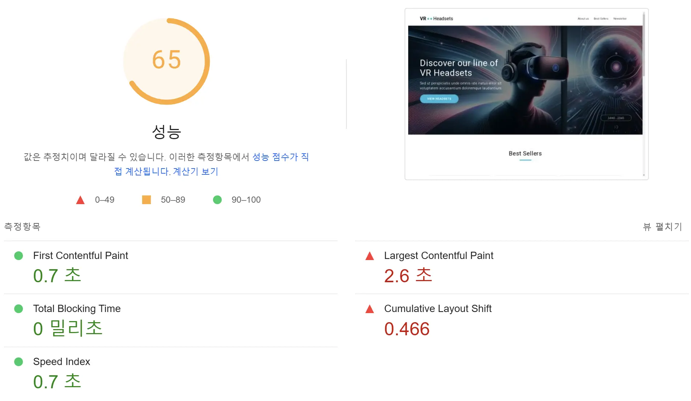
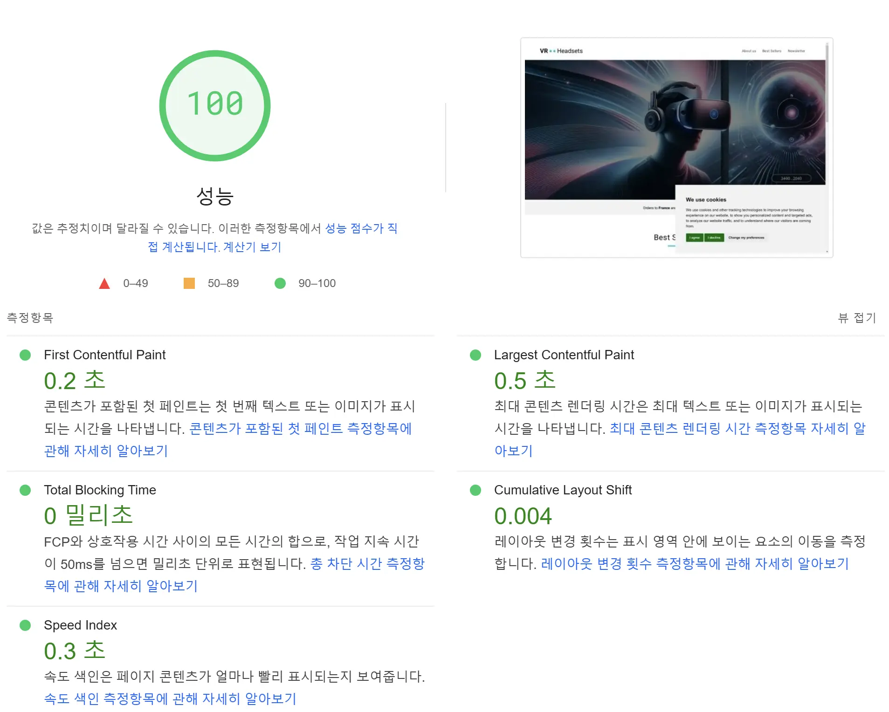

# 바닐라 JS 프로젝트 성능 개선 [기본 과제]
- url: [`d3ko9vd7loegqu.cloudfront.net`](http://d3ko9vd7loegqu.cloudfront.net)

## 📚 [Core Web Vitals 용어 정리](https://support.google.com/webmasters/answer/9205520?hl=ko)

### 1. LCP(최대 콘텐츠 렌더링 시간): 
- 사용자가 URL을 요청한 시점부터 표시 영역에 가장 큰 시각 콘텐츠 요소를 렌더링하는 데 걸린 시간입니다. 

- 가장 큰 요소는 일반적으로 이미지 또는 동영상이거나 큰 블록 수준의 텍스트 요소입니다. 

- 이 측정항목은 방문자가 URL이 실제로 로드되는 것을 확인하는 속도를 표시하므로 중요합니다.

- 보고서에 표시된 그룹 LCP란 그룹에 포함된 URL 방문수의 75%가 LCP 상태에 도달하기까지 걸린 시간입니다.

### 2. INP(다음 페인트까지의 상호작용): 
- 페이지에서 사용자의 페이지 방문 전체 생애 주기 동안 발생하는 모든 클릭, 탭, 키보드 상호작용에 반응하기까지 걸리는 시간을 관찰하여 사용자 상호작용에 대한 페이지의 전반적인 반응성을 평가하는 측정항목입니다. 

- 최종 INP 값은 관찰된 가장 긴 상호작용이며 이상점을 무시합니다. 

- 보고서에 표시된 그룹 INP란 그룹에 포함된 URL 방문수의 75%가 이 값을 나타냈음(또는 그보다 높을 수 있음)을 의미합니다.

### 3. CLS(누적 레이아웃 이동): 
- CLS는 페이지의 전체 수명 동안 발생하는 모든 예상치 못한 레이아웃 변화의 모든 개별적인 레이아웃 변화 점수의 총 합계를 측정합니다. 

- 점수는 0부터 시작하며 양수인 수입니다. 여기에서 0은 변화가 없음을 나타내며 숫자가 클수록 페이지의 레이아웃이 많이 변경되었음을 보여줍니다. 

- 사용자가 상호작용하려고 할 때 페이지 요소가 변경되는 사용자 환경은 좋지 않으므로 CLS는 중요합니다. 

- 왜 큰 값이 표시되었는지 알 수 없다면 페이지와 상호작용해 보면서 점수에 어떻게 영향을 주는지 확인합니다.

### 4. Core Web Vitals 기준값
- **LCP (Largest Contentful Paint)**: 가장 큰 콘텐츠가 화면에 그려지는 시점 
  - 🟢 Good: < 2.5s
  - 🟠 Needs Improvement: < 4.0s
  - 🔴 Poor: ≥ 4.0s

- **INP (Interaction to Next Paint)**: 사용자 상호작용에 대한 전반적인 응답성
  - 🟢 Good: < 200ms
  - 🟠 Needs Improvement: < 500ms
  - 🔴 Poor: ≥ 500ms

- **CLS (Cumulative Layout Shift)**: 페이지 로드 중 예기치 않은 레이아웃 변경의 정도
  - 🟢 Good: < 0.1
  - 🟠 Needs Improvement: < 0.25
  - 🔴 Poor: ≥ 0.25

 

## 🔰 성능 개선 보고서
### 1. 개선 이유
초기 성능 분석 결과, 바닐라 JS로 작성된 웹사이트의 여러 핵심 성능 지표들이 Google의 권장 기준에 미치지 못하는 것을 확인했습니다. 특히 레이아웃 변경(CLS)과 최대 콘텐츠 렌더링 시간(LCP)에서 상당한 개선이 필요했습니다. 이러한 성능 이슈들은 사용자 경험을 저해하고 검색 엔진 최적화에도 부정적인 영향을 미칠 수 있어 성능 개선 작업이 필요하다고 생각 했습니다.

## 2. 개선 방법

### 2.1 이미지 최적화
* Hero 섹션의 이미지에 대해 디바이스별 최적화된 크기를 제공하도록 구현했습니다. 
* fetchpriority="high" 속성을 추가하여 중요 이미지의 로딩 우선순위를 높였습니다.
* JPG 이미지를 최신 포맷인 WebP로 변환하여 시각적 품질은 유지하면서도 파일 크기를 25-35% 줄임으로써 페이지 로딩 속도를 개선하고 사용자의 데이터 사용량을 줄였습니다.

### 2.2 JavaScript 최적화
Google Tag Manager의 초기화 시점을 조정하여 페이지 초기 로딩에 미치는 영향을 최소화했습니다. 페이지 로드 이벤트 이후로 스크립트 실행을 지연시켜 초기 렌더링 성능을 개선했습니다.

### 2.3 레이아웃 안정성 개선
레이아웃 변경을 최소화하기 위해 이미지 요소들에 명시적인 크기를 지정하고, CSS를 통해 컨테이너의 크기를 사전에 확보했습니다. 이를 통해 콘텐츠 로딩 중 발생하는 레이아웃 변경을 크게 줄일 수 있었습니다.

## 3. 개선 후 향상된 지표

| 지표                           | 개선 전  | 개선 후  | 개선율  |
|--------------------------------|---------|---------|--------|
| First Contentful Paint (FCP)   | 0.7초   | 0.2초   | 71.4%  |
| Largest Contentful Paint (LCP) | 2.6초   | 0.5초   | 80.8%  |
| Cumulative Layout Shift (CLS)  | 0.466초 | 0.004초 | 99.1%  |